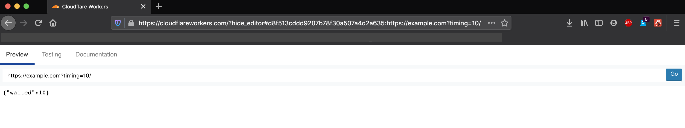

# Cloudflare Workers

Investigation into CloudFlare Workers, and the CloudFlare platform in general.

## Background

I know of CloudFlare as a security company, providing DDOS protection and various other high-bandwidth defense mechanisms.
In amongst that, they also do bot protection (ScrapeShield), content delivery (Stream Delivery for media, cache and hosting 
for general web traffic), web-app firewalls, among a few other things. They've also done some virus defense stuff in the past, 
providing DNS black holes and stepping in during large scale DDOS ransom attempts.

## Pricing

### Common to both plans:

* Deploy up to 30 workers
* Global deployments
* No "cold starts"
* Auto-scaled to required
* 128mb memory per worker
* Free usage of the `<username>.workers.dev` domain, to test deploy your workers too.

### Free plan

* 100'000 reqests per day (across _all_ your workers)
* Up to 10ms CPU time per request (reality ~20ms)
* First request _may_ be slow, subsequent will be lowest latency

### Paid plan

* 10'000'000 requests per month
* Up to 50ms CPU time per request (reality ~60ms)
* Every request will be lowest latency
* Access to worker KV storage (100 namespaces, 1gb storage 10mil read, 1mil write, 1mil delete, 1mil list, pay for more)

## Runtime Environment

Running in essentially V8 isolates. Looks modified, as they've overriden some functionality, especially around web requests and the time API's.
Supports raw V8 JS, so essentially anything you can run in Chrome. This can be a bit weird, because as a server-side environment, you might expect NodeJS support, but its not. Can use `type = 'webpack'` in the `wrangler.toml` to run the default webpack config over your code, else it'll error on NodeJS stuff like `require('lib')` or similar.

Also supports WASM. Seems to have had mixed reception on this, reports only _some_ WASM libraries generate "CloudFlare Worker Compliant" WASM (eg: the Golang wasm compiler doesn't seem to work, but the Rust wasm compiler worked fine). Seems CloudFlare uses Rust internally for a lot of there stuff, so at least that has pretty good support.

Designed around running stateless/serverless blocks of code, however, can do some rudimentary storage. For example, its mentioned you can use global vars to store _some_ data, but its volatile and gets wiped occassionally, so don't rely on it. The Worker KV storage is recommended for long-er term storage, however, its query capabilities are limited (its a fairly strict Key-Val store, with )

## Security

Uses API tokens, can be fairly granularly configured. In this context, Zone = DNS Zone.

Not quite as detailed as eg: AWS IAM or GCP IAM, but probably enough given what you can run (eg: theres not database offering, so you probably wouldn't store any seriously sensitive data here anyway).

## Dev Experience

### `wrangler`

The CloudFlare version of `gcloud` or `aws` CLI's. Only used for CloudFlare workers and the worker KV database.
Configuration mostly done in the project `wrangler.toml` file.

Can also generate template projects (`wrangler generate` for a full folder, `wrangler init` for just the `wrangler.toml` config file)

Whole CLI seems rather primitive. Very few commands, <5 arguments or flags on most commands, everything's at the top level, etc.
Lots of little annoyances, examples:
* Doesn't have a "builder" for `wrangler generate` like with `npm init`, so you have to go into the `wrangler.toml` to add extra stuff
* Default `wrangler generate` comes with `prettier`, and two seperate licenses? Bit of an odd choice to include
* Doesn't allow you to tell it to not initialize a git repo when generating from a template
* `wrangler preview` includes an incredibly basic request builder, similar to postman, but with no built-in JSON support, no ability to save your requests, not even a way to see timings or anything?
* The `wrangler kv:*` commands will often return something like "Add the following to your wrangler.toml", instead of just adding it for you, like in eg: `cargo` or `npm i` of `go`.

#### `wrangler preview`

Basic "npm start" equivilant. Builds and uploads the local code to a push-button-esque environment, exposing an "IDE" style environment.
Shows the response from the worker on the first page, a rudimentary request crafter + sender on the second, and an iframe to the CloudFormation docs on the third.

Need to re-deploy to see changes. On the free plan, can sometimes take a few requests to actually start responding 
(its got a some sort of warmup time).

#### `wrangler publish`

Publishes to the domain + route specified in the `wrangler.toml`. If no domain or route provided, will deploy to `<project_name>.<account_username>.workers.dev`, a free domain provided under either plan.

## Integrations

For Infra-As-Code, they have the wrangler CLI (just a NPM package, so can be installed anywhere), as well as support from:
* [Terraform](https://www.terraform.io/docs/providers/cloudflare/guides/version-2-upgrade.html)
* [Serverless](https://www.serverless.com/framework/docs/providers/cloudflare/)
* Or a [Rest API](https://developers.cloudflare.com/workers/tooling/api), if you want to do something custom.

They also have a [Github Actions](https://github.com/cloudflare/wrangler-action) integration to help with CI. 
However, since you just need the `wrangler` CLI via NPM, its not too hard to do something custom.

## Overall Pros/Cons

### Pros

* Fast to get started and get deployed.
* Simple tooling makes it quick to learn
* Nice abstraction makes it easy to reason with (don't have to worry about zones or regions or API gateways)
* Quite nice tooling for "security" style requirements (eg: simple tracking between requests, inline req/resp re-writes, etc.)

### Cons

* Relatively immature tooling and support
* No "wiring" or "piping" capabilities like AWS Lambda or Firebase Functions (eg: on S3 write, trigger Lambda. Theres not really an equivilant for CF Workers)
* 

## Probable Use Cases

* Mostly-Static sites. Automatic global scaling, free tier is quite generous, can do basic logic eg: auth, dynamic redirects, etc.
* Hyper performance requirements. If you want to scale to millions of users, especially in short bursts, may be worth considering.
* WASM support.
* Existing CloudFlare usage, and extremely simple use case.
* On-the-fly request/response editing (eg: adding a WAF script to every HTML page served, or scanning for blacklisted regex strings in all requests).
